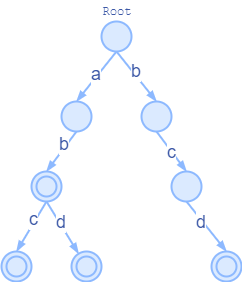

# 基于DFA/字典树的敏感词检测示例

## 功能

输入：敏感词组、待检测文本

输出：检测文本中存在的敏感词

## 用法

```java
// 构建字典树
TrieState root = new TrieTreeBuilder().addWords("abc","abd","bcd","ab").build();
// 使用字典树构建检测器
SensitiveWordsChecker checker = new SensitiveWordsChecker(root);
// 检测文本
Set<String> illWords = checker.check("12adwe2331qweasdabcdasdcdbsdf2aqqwqxz");
```
## 原理

敏感词检测分为两步：

1. 将敏感词组构造成字典树

2. 遍历待检测文本，与字典树进行匹配，如果可以达到接收状态则表示检测到敏感词

字典树本身就是一个DFA，从根节点出发，转移条件为敏感词的字符，直到敏感词结尾作为接收状态。以敏感词组`["abc","abd","bcd","ab"]`为例，生成的字典树如下所示：


